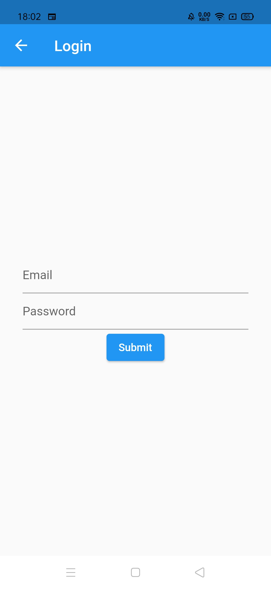

# Email and password Authentication via firebase In Flutter

Create Email and password Authentication via firebase In Flutter

This amazing app is provided in open source. So, helpful contributions are highly appreciated.

## ScreenShots

|  |   | 

---

### :heart: Found this project useful?

If you found this project useful, then please consider giving it a :star: on Github and sharing it with your friends via social media.

---

## Project Created & Maintained By

### Siddharth Chopra

## Getting Started

This project is a starting point for a Flutter application.

- clone repo and setup dart plugin
- create firebase project
- download firebase google json file and save it inside app folder

